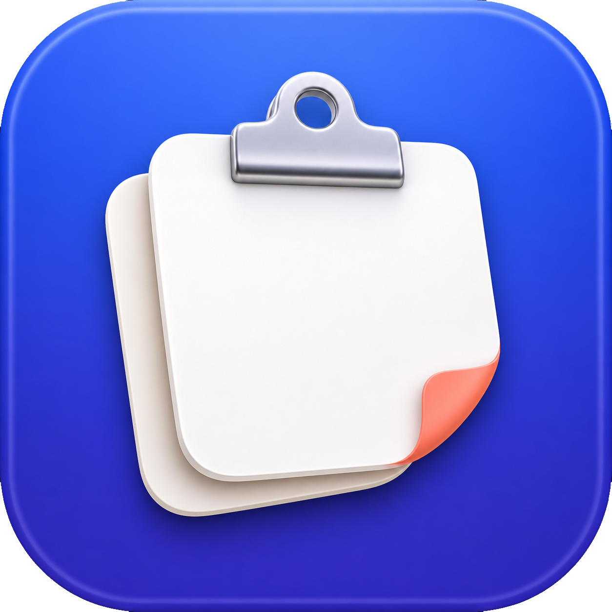
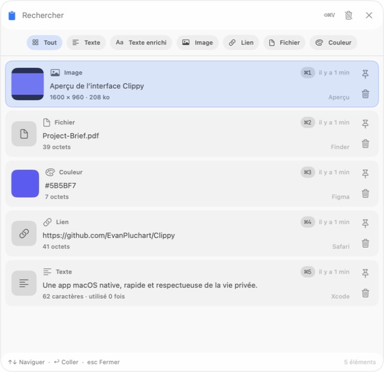
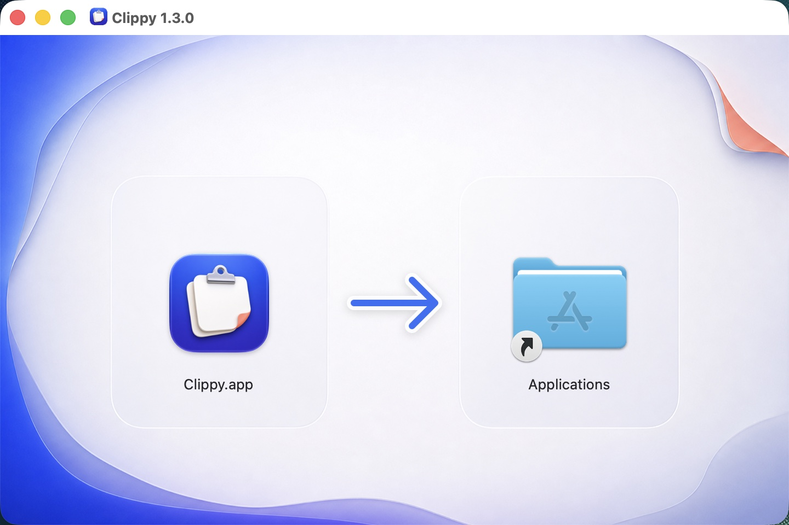
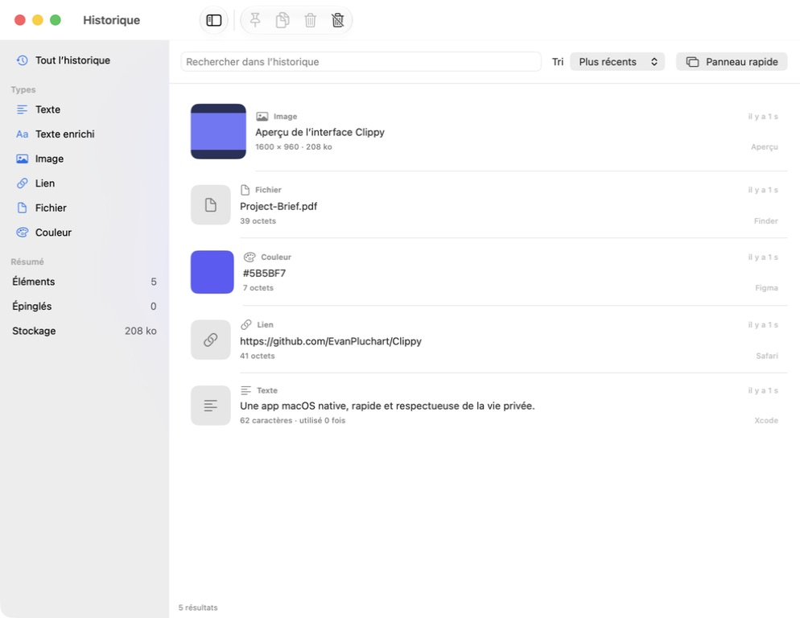
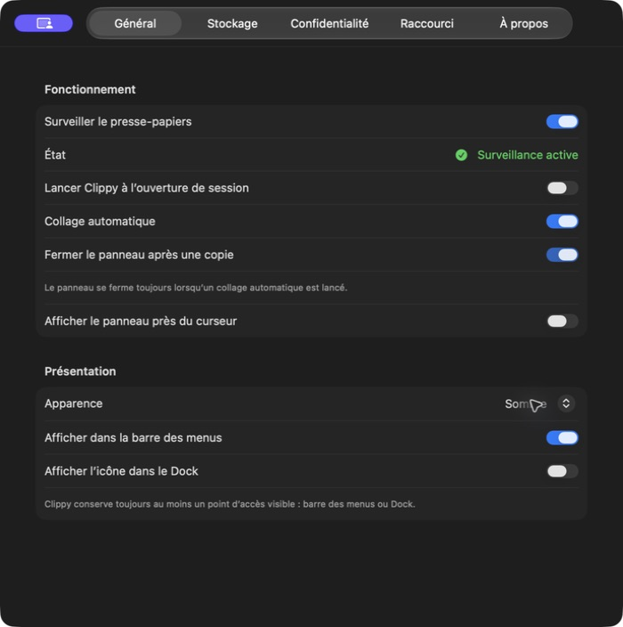

# Clippy

<p align="center">
  
</p>

<p align="center">
  Un historique de presse-papiers macOS rapide, privé et pensé pour le clavier.
</p>

<p align="center">
  <a href="https://clippy.evanpluchart.fr">Site web</a>
  ·
  <a href="README.md">English</a>
  ·
  <a href="CHANGELOG.md">Changelog</a>
  ·
  <a href="CONTRIBUTING.md">Contribuer</a>
  ·
  <a href="SECURITY.md">Sécurité</a>
</p>

<p align="center">
  
  
  
  
</p>

Clippy apporte à macOS un sélecteur de presse-papiers natif avec `⌘⇧V`. L’app reste discrètement dans la barre des menus, conserve l’historique sur votre Mac et colle l’élément choisi dans l’app utilisée juste avant. La fenêtre d’historique n’a jamais besoin de rester ouverte.



## Sommaire

- [Installation](#installation)
- [Utiliser Clippy](#utiliser-clippy)
- [Raccourcis clavier](#raccourcis-clavier)
- [Fonctionnalités](#fonctionnalités)
- [Autorisations et dépannage](#autorisations-et-dépannage)
- [Vie privée](#vie-privée)
- [Langues](#langues)
- [Développement](#développement)
- [Release](#release)
- [Licence](#licence)

## Installation

### Téléchargement direct — le plus simple

Téléchargez le dernier DMG signé et notarié depuis [clippy.evanpluchart.fr](https://clippy.evanpluchart.fr), ouvrez-le, puis glissez Clippy dans Applications.



Si le site affiche encore « Téléchargement bientôt disponible », la release signée n’a pas encore été publiée. La compilation depuis les sources reste disponible ci-dessous.

### Homebrew — recommandé pour les utilisateurs du Terminal

```sh
brew install --cask EvanPluchart/tap/clippy
```

Ouvrez ensuite Clippy depuis Applications ou avec :

```sh
open -a Clippy
```

Pour mettre à jour ou désinstaller l’app :

```sh
brew upgrade --cask clippy
brew uninstall --cask clippy
```

> Le Cask devient disponible avec la première release publique signée Developer ID et notariée. Si Homebrew indique que le Cask n’existe pas encore, utilisez temporairement la compilation locale ci-dessous.

### Compiler depuis les sources

Prérequis : macOS 14 Sonoma ou plus récent et Xcode 16 ou plus récent.

```sh
git clone https://github.com/EvanPluchart/Clippy.git
cd Clippy
./scripts/build_local.sh
ditto dist/local/Clippy.app /Applications/Clippy.app
open /Applications/Clippy.app
```

Le script crée une app universelle Apple silicon et Intel dans `dist/local/Clippy.app`. Elle est signée ad hoc pour le développement local ; les releases publiques sont signées Developer ID et notariées.

## Utiliser Clippy

1. Ouvrez Clippy et terminez la courte introduction.
2. Copiez un texte, une image, un lien ou un fichier.
3. Appuyez sur `⌘⇧V`.
4. Déplacez-vous avec `↑` et `↓`, puis appuyez sur Entrée pour coller.
5. Accordez l’autorisation Accessibilité lorsque macOS la demande. Elle sert uniquement au collage automatique dans l’app précédemment active.

Clippy peut fonctionner uniquement dans la barre des menus, sans icône dans le Dock. Ouvrir l’app à nouveau depuis le Finder ou Applications affiche l’historique complet.

## Raccourcis clavier

| Action | Raccourci |
| --- | --- |
| Ouvrir le panneau rapide | `⌘⇧V` |
| Déplacer la sélection | `↑` / `↓` |
| Coller l’élément sélectionné | `Entrée` |
| Coller le résultat 1 à 9 | `⌘1`…`⌘9` |
| Fermer le panneau rapide | `Échap` |
| Ouvrir les réglages | `⌘,` |

Le raccourci global se modifie dans **Réglages → Raccourci**.

## Fonctionnalités

- App native Swift 6, SwiftUI, AppKit et SwiftData
- Textes, textes enrichis, liens, fichiers, images et couleurs hexadécimales
- Recherche, filtres par type, navigation clavier et `⌘1`…`⌘9`
- Restauration du focus et collage automatique dans l’app précédente
- Historique complet avec tri, pagination, sélection multiple, épinglage et suppression groupée
- Rétention, limite de stockage, déduplication et types ignorés configurables
- Exclusions d’applications et motifs personnalisés de contenu sensible
- Lancement à l’ouverture de session facultatif
- Apparences système, claire et sombre
- Interface française et anglaise, choisie automatiquement selon macOS
- Aucun compte, cloud, tracking, télémétrie ou client réseau
- Binaire universel Apple silicon et Intel





## Autorisations et dépannage

### Pourquoi l’autorisation Accessibilité est nécessaire

La lecture et l’écriture du presse-papiers ne déclenchent aucune demande d’autorisation macOS. Le raccourci global utilise l’API publique Carbon et ne surveille pas les autres frappes.

Le collage automatique nécessite **Réglages Système → Confidentialité et sécurité → Accessibilité**. Clippy écrit l’élément choisi dans le presse-papiers, rend le focus à l’app précédente, puis envoie `⌘V`.

La build Developer ID n’utilise volontairement pas App Sandbox, incompatible avec ce workflow Accessibilité autorisé par l’utilisateur. Hardened Runtime reste activé et l’app n’a aucun entitlement ou dépendance réseau.

### Le collage automatique ne fonctionne pas

1. Quittez toutes les copies de Clippy.
2. Vérifiez que l’app se trouve dans `/Applications/Clippy.app`.
3. Ouvrez **Réglages Système → Confidentialité et sécurité → Accessibilité**.
4. Désactivez puis réactivez Clippy. Si macOS référence encore une ancienne build, retirez Clippy de la liste puis ajoutez `/Applications/Clippy.app` à nouveau.
5. Rouvrez Clippy et vérifiez **Réglages → Général → Collage automatique**.

Sans autorisation Accessibilité, choisir un élément le copie tout de même dans le presse-papiers afin de pouvoir le coller manuellement.

### `⌘⇧V` n’ouvre pas le panneau

- Ouvrez **Réglages → Raccourci** et vérifiez que le raccourci est actif.
- Une autre app utilise peut-être la même combinaison ; choisissez-en une autre puis cliquez sur **Appliquer**.
- Activez **Lancer Clippy à l’ouverture de session** pour garder le raccourci disponible après chaque redémarrage.

## Vie privée

L’historique est stocké localement dans :

```text
~/Library/Application Support/Clippy/
├── database/Clippy.store
├── images/
└── thumbnails/
```

Les préférences sont enregistrées dans `~/Library/Preferences/com.evpl.clippy.plist`.

Clippy ne transmet jamais le presse-papiers. L’app n’intègre ni télémétrie, ni SDK de crash, ni configuration distante, ni mise à jour intégrée, ni client réseau. Les réglages permettent de mettre la surveillance en pause, d’exclure des applications, d’ignorer certains types, de filtrer des expressions régulières personnalisées et d’effacer tout l’historique local.

Au premier lancement, Clippy récupère proprement l’historique et les préférences compatibles des anciennes builds sandboxées. La migration est idempotente et laisse les anciennes données intactes.

La détection de contenu sensible est défensive, pas infaillible. Vérifiez les réglages de confidentialité avant d’utiliser un gestionnaire de presse-papiers avec des données confidentielles.

## Langues

Clippy 1.3 est disponible en français et en anglais. L’app suit automatiquement la langue préférée configurée dans macOS et utilise le français si aucune langue prise en charge n’est sélectionnée.

## Développement

Prérequis :

- macOS 14 Sonoma ou plus récent
- Xcode 16 ou plus récent
- Swift 6

Ouvrez `Clippy.xcodeproj` et lancez le scheme partagé **Clippy**, ou exécutez :

```sh
swift test -Xswiftc -strict-concurrency=complete -Xswiftc -warnings-as-errors
```

Le projet n’a aucune dépendance d’exécution tierce. Après l’ajout ou la suppression d’un fichier Swift ou d’une ressource, régénérez le projet Xcode versionné :

```sh
ruby scripts/generate_xcodeproj.rb
```

Validez le catalogue de traduction et ses paramètres de formatage avec :

```sh
ruby scripts/validate_localizations.rb
```

La CI compare également le catalogue aux clés de localisation émises par le compilateur Swift.

### Architecture

```text
Clippy/
├── App/             cycle de vie, état partagé et contrôleurs de fenêtres AppKit
├── Models/          modèle SwiftData et réglages Codable
├── Repositories/    accès transactionnel à l’historique
├── Services/        surveillance, analyse, collage, stockage et nettoyage
├── Utilities/       normalisation, hash, filtres privés et localisation
├── Views/           panneau rapide, historique, réglages, onboarding et menu
└── Resources/       icône, traductions, entitlements et manifeste de confidentialité
```

Les images originales sont stockées sous forme de PNG normalisés. De petites miniatures JPEG et un cache borné d’images décodées gardent les listes fluides. Les chemins enregistrés sont relatifs et validés avant chaque accès.

## Release

`scripts/release.sh` exécute les tests stricts, crée une archive universelle, la signe avec Developer ID, valide les entitlements, notarie et agrafe l’app puis le DMG, vérifie Gatekeeper, produit le DMG et son SHA-256, puis génère le Cask Homebrew.

```sh
SIGN_IDENTITY="Developer ID Application: Your Name (TEAMID)" \
NOTARY_PROFILE="clippy-notary" \
DEVELOPMENT_TEAM="TEAMID" \
./scripts/release.sh
```

Consultez [CONTRIBUTING.md](CONTRIBUTING.md) avant d’ouvrir une pull request et [SECURITY.md](SECURITY.md) pour signaler une vulnérabilité.

## Licence

Clippy est distribué sous [licence MIT](LICENSE).
