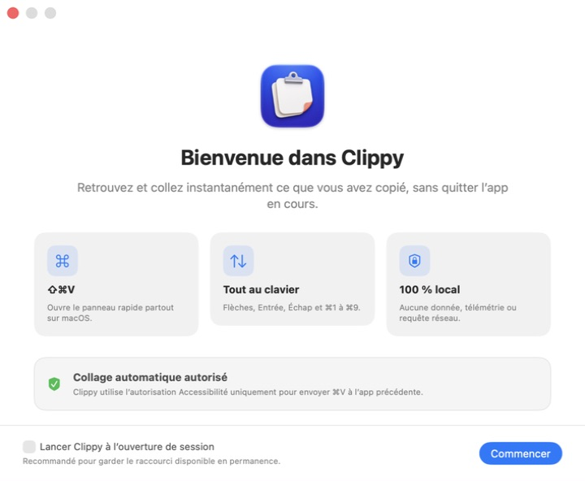

# Clippy

<p align="center">
  
</p>

<p align="center">
  Un historique de presse-papiers macOS rapide, privé et pensé pour le clavier.
</p>

<p align="center">
  <a href="README.md">English</a>
  ·
  <a href="CHANGELOG.md">Changelog</a>
  ·
  <a href="SECURITY.md">Sécurité</a>
</p>

Clippy apporte à macOS un sélecteur de presse-papiers natif avec `⌘⇧V`. L’app reste discrètement dans la barre des menus, conserve l’historique sur le Mac et colle l’élément choisi dans l’app utilisée juste avant. La fenêtre d’historique n’a jamais besoin de rester ouverte.

> L’interface de Clippy 1.2 est en français. La localisation anglaise est prévue pour la prochaine release.


## Points forts

- Application native Swift 6, SwiftUI, AppKit et SwiftData
- Textes, RTF, liens, fichiers, images et couleurs hexadécimales
- Navigation rapide : recherche, filtres, flèches, Entrée, Échap et `⌘1`…`⌘9`
- Retour du focus et collage automatique dans l’app précédente
- Historique complet avec tri, sélection multiple, épinglage et suppression groupée
- Rétention, déduplication et types ignorés configurables
- Exclusions d’apps et motifs de contenu sensible personnalisés
- Lancement à l’ouverture de session facultatif
- Apparences système, claire et sombre
- Aucun compte, cloud, tracking, télémétrie ou accès réseau
- Binaire universel Apple silicon et Intel


## Installation

### Homebrew et téléchargement direct

Le Cask public et l’app téléchargeable seront publiés avec la première release signée Developer ID et notariée. En attendant, Clippy peut être compilé localement depuis les sources.

### Build locale

```sh
git clone https://github.com/EvanPluchart/Clippy.git
cd Clippy
./scripts/build_local.sh
```

L’app universelle signée localement est créée dans `dist/local/Clippy.app`. Les releases publiques sont signées Developer ID et notariées par Apple.

## Première utilisation



1. Ouvrez Clippy et suivez l’onboarding.
2. Activez **Lancer Clippy à l’ouverture de session** si vous voulez garder `⌘⇧V` disponible après chaque redémarrage.
3. Copiez un texte, une image, une URL ou un fichier.
4. Appuyez sur `⌘⇧V`, choisissez avec les flèches, puis validez avec Entrée.
5. Accordez l’autorisation Accessibilité lorsque macOS la demande. Elle sert uniquement à envoyer `⌘V` dans l’app précédemment active.

Clippy peut fonctionner uniquement dans la barre des menus, sans icône dans le Dock.
Si Clippy est déjà lancé, l’ouvrir à nouveau depuis le Finder ou Applications affiche la fenêtre d’historique.

## Autorisations

La lecture et l’écriture du presse-papiers ne déclenchent aucune demande d’autorisation macOS. Le raccourci global utilise l’API publique Carbon et ne surveille pas les autres frappes.

Le collage automatique nécessite **Réglages Système → Confidentialité et sécurité → Accessibilité**. Clippy écrit d’abord l’élément choisi dans le presse-papiers, rend le focus à l’app précédente, puis envoie Commande-V.

La build Developer ID n’utilise volontairement pas App Sandbox, incompatible avec les clients Accessibilité macOS. Hardened Runtime reste activé, aucun entitlement réseau n’est présent et tout le traitement reste local.

Si le collage automatique ne fonctionne pas après l’autorisation :

1. Quittez toutes les copies de Clippy.
2. Vérifiez que l’app se trouve bien dans `/Applications/Clippy.app`.
3. Désactivez puis réactivez Clippy dans les réglages Accessibilité. Supprimez-la et ajoutez-la de nouveau si macOS référence une ancienne build.
4. Rouvrez Clippy et vérifiez que **Réglages → Général → Collage automatique** est activé.

## Vie privée

L’historique se trouve dans :

```text
~/Library/Application Support/Clippy/
├── database/Clippy.store
├── images/
└── thumbnails/
```

Les préférences sont enregistrées dans `~/Library/Preferences/com.evpl.clippy.plist`.

Au premier lancement, Clippy récupère automatiquement l’historique et les préférences compatibles de l’ancien conteneur sandboxé. La migration est idempotente et ne modifie pas les anciennes données.

Clippy ne transmet jamais le presse-papiers. L’app n’intègre ni télémétrie, ni SDK de crash, ni configuration distante, ni mise à jour réseau. Les réglages permettent de mettre la surveillance en pause, exclure des apps, ignorer certains types, filtrer des motifs sensibles et effacer tout l’historique local.

Le filtre sensible est défensif, pas infaillible. Un gestionnaire de presse-papiers peut contenir des données privées : vérifiez les réglages avant un usage confidentiel.

## Raccourcis

| Action | Raccourci |
| --- | --- |
| Ouvrir le panneau rapide | `⌘⇧V` |
| Déplacer la sélection | `↑` / `↓` |
| Coller l’élément | `Entrée` |
| Choisir le résultat 1 à 9 | `⌘1`…`⌘9` |
| Fermer le panneau | `Échap` |
| Ouvrir les réglages | `⌘,` |

Le raccourci global se personnalise dans **Réglages → Raccourci**.

## Développement

Prérequis : macOS 14+, Xcode 16+ et Swift 6.

```sh
swift test -Xswiftc -strict-concurrency=complete -Xswiftc -warnings-as-errors
```

Le projet n’a aucune dépendance d’exécution tierce. Après l’ajout ou la suppression d’un fichier Swift :

```sh
ruby scripts/generate_xcodeproj.rb
```

Le script `scripts/release.sh` teste, archive, signe, notarie, agrafe le ticket Apple, crée le ZIP et son SHA-256, puis génère le Cask Homebrew. Consultez [CONTRIBUTING.md](CONTRIBUTING.md) et [SECURITY.md](SECURITY.md) pour contribuer ou signaler une vulnérabilité.

## Licence

Clippy est distribué sous [licence MIT](LICENSE).
